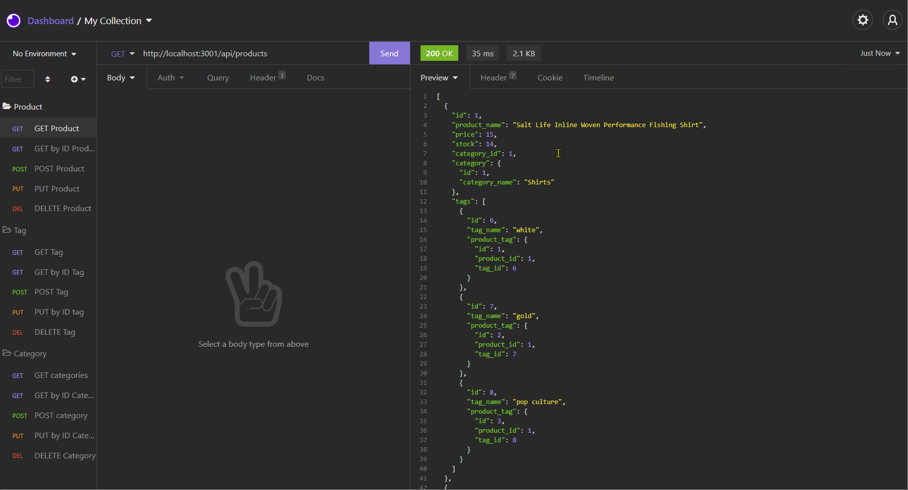

# E-Commerce-Back-End
  -----------------

## Table of Contents
  - [Description](#Description)
  - [Installation Instructions and Getting Started](#Installation)
  - [Built With](#Built)
  - [Technologies Used](#Technologies)
  - [Authors](#Authors)
  - [Acknowledgments](#Acknowledgments)


## Description
Pretend you own a store that sells wacky things and need to test the backend of your wacky website! Try out this mock e-commerce backend built with MySQL, Sequelize, Express.js, and Node.js.


**[Click this link WATCH the E-commerce backend in action](https://watch.screencastify.com/v/Vu1HEwMkHq81wdsKsX0w)**



 <br />


## Installation Instructions and Getting Started
Node.js, MySQL2, Express.js, Sequelize, and Dotenv all need to be installed. 

Startup Instructions
1) Create a .env file with the following information:
```
DB_USER= *your username here*
DB_PW= *your password here*
DB_NAME='ecommerce_db'
```

2) To start the application, navigate in a command console to the "db" folder that houses schema.sql. Enter in 'mysql -u root -p' and enter in your password. This will start up a MySQL instance. Then, enter into console 'source schema.sql', hit enter. Your SQL database is now created.

3) Start a new console session and enter in 'npm run seed'. This will seed that database with information.

4) Now enter in 'npm start'. You are now ready to begin. Your database should be available at http://localhost:3001/api/

## Built With
* [JavaScript](https://developer.mozilla.org/en-US/docs/Web/JavaScript)
* [Node.js](https://nodejs.org/en/)
* [Express.js](https://expressjs.com/)
* [MySQL2](https://www.npmjs.com/package/mysql2)
* [Sequelize](https://www.npmjs.com/package/sequelize)
* [Dotenv](https://www.npmjs.com/package/dotenv)

## Technologies Used
* [Microsoft Visual Studio Code](https://code.visualstudio.com/)
* [Git Bash](https://git-scm.com/downloads)
* [GitHub](https://github.com/)
* [Insomnia](https://insomnia.rest/)

## Practices Used
* Agile style User Story and Acceptance Criteria.


## Authors
**Alexander Gibson** 

- [Link to Alex's Portfolio Site](https://argibson02.github.io/Professional-Portfolio-2/)
- [Link to Alex's Github](https://github.com/argibson02)
- [Link to Alex's LinkedIn](www.linkedin.com/in/alexander-gibson-1b0bb6105)


## Acknowledgments 😊
- Thanks to Jerome, Manuel, Cheng, and Daniel for instructing the UCB Coding Bootcamp.


[](https://opensource.org/licenses/MPL-2.0)